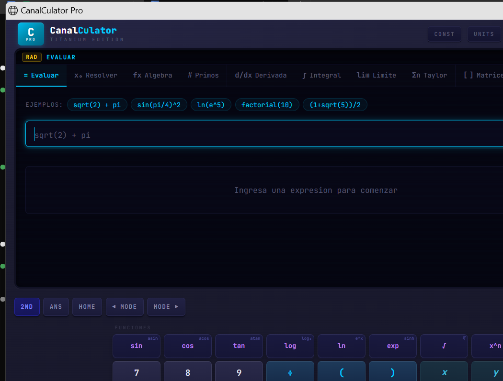
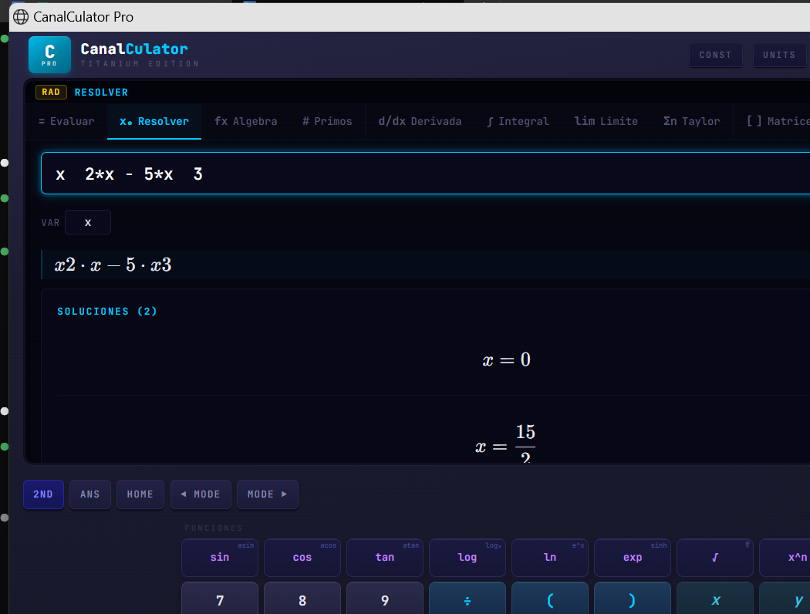
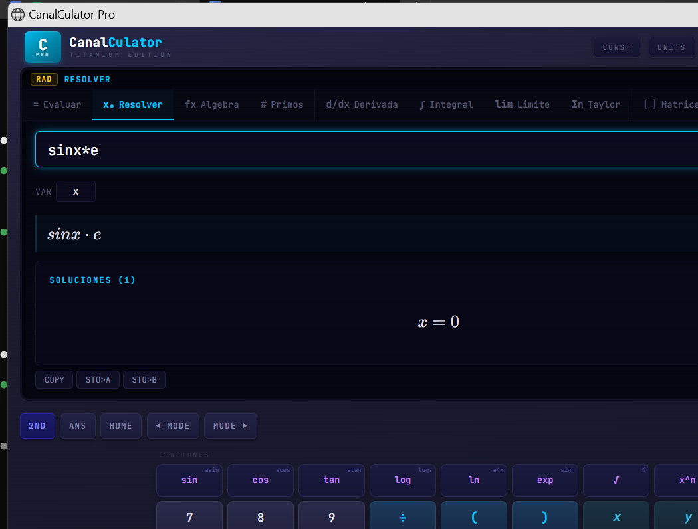

  

<h1 align="center">CalcuLibre</h1>
<h3 align="center">Titanium Edition</h3>

  <b>La calculadora CAS gratuita que todo estudiante de ingenieria merece.</b> 
  Porque no deberiamos tener que pagar $200 USD por una Texas Instruments para poder derivar, integrar y resolver EDOs.

  
  
  
  

---

## La historia detras de esto

Siempre quise una TI-Nspire CX II CAS. Desde que entre a ingenieria comercial en la Universidad de Talca, vi como algunos compañeros la tenian y hacian cosas increibles: derivadas simbolicas, integrales definidas paso a paso, resolver sistemas de ecuaciones en segundos. Pero cuesta mas de $200 USD. Para un estudiante chileno, eso es demasiado.

Asi que me puse a construir la mia propia. Pero no queria solo una imitacion — queria algo **mejor**. Mas modos de calculo, mas herramientas de ingenieria, graficos interactivos, y sobre todo: **gratis para todos**.

CalcuLibre es el resultado. Una calculadora CAS de escritorio con motor algebraico completo, diseño inspirado en las TI Titanium, y cero costo.

---

## Que es un CAS y por que importa

**CAS** = Computer Algebra System (Sistema de Algebra Computacional).

A diferencia de una calculadora comun que solo te da numeros, un CAS trabaja con **expresiones simbolicas**. Esto significa que:

- No solo calcula `sin(pi/4) = 0.707...` sino que te dice que es `sqrt(2)/2`
- Puede derivar `x^3 * sin(x)` y darte la expresion exacta: `3x^2*sin(x) + x^3*cos(x)`
- Resuelve ecuaciones algebraicas de forma analitica, no por aproximacion numerica
- Factoriza polinomios, expande expresiones, simplifica fracciones complejas
- Calcula integrales simbolicas (indefinidas y definidas)
- Resuelve ecuaciones diferenciales ordinarias (EDOs)
- Opera con matrices de forma simbolica
- Calcula transformadas de Laplace, series de Taylor/Maclaurin

El motor CAS detras de CalcuLibre es **SymPy**, la misma libreria de algebra computacional que usan investigadores, universidades y herramientas profesionales en todo el mundo. Es open source, auditada por la comunidad cientifica, y con precision aritmetica arbitraria.

### Como funciona internamente

Cuando escribes una expresion como `integrate(x^2 * exp(-x), x)`:

1. **Parsing**: La expresion se convierte de texto a un arbol de simbolos matematicos (AST)
2. **Transformacion**: SymPy aplica reglas algebraicas, identidades trigonometricas, y algoritmos de integracion (Risch, heuristicas, tablas conocidas)
3. **Simplificacion**: El resultado pasa por multiples etapas de simplificacion para darte la forma mas limpia posible
4. **Renderizado LaTeX**: El resultado se convierte a notacion matematica real usando KaTeX, asi lo ves como en un libro de calculo

Todo esto ocurre localmente en tu PC. No necesitas internet. No hay servidores. No hay suscripciones. Tu calculadora, tu maquina.

---

## Modos de calculo

CalcuLibre tiene **13 modos de calculo**, cada uno optimizado para un tipo de problema:

| Modo | Que hace | Ejemplo |
|------|----------|---------|
| **Resolver** | Resuelve ecuaciones algebraicas | `x^2 - 5x + 6 = 0` → `x = 2, x = 3` |
| **Derivadas** | Derivadas simbolicas, parciales, de orden n | `d/dx(sin(x)*e^x)` → `e^x*(sin(x) + cos(x))` |
| **Integrales** | Integrales indefinidas y definidas | `∫ x^2*ln(x) dx` → resultado exacto |
| **Limites** | Limites, laterales, al infinito | `lim(sin(x)/x, x→0)` → `1` |
| **Series** | Taylor, Maclaurin, expansion en series | `series(e^x, x, 0, 5)` → `1 + x + x^2/2 + ...` |
| **Matrices** | Determinante, inversa, eigenvalores, rango | Matrices NxN con entrada visual |
| **EDO** | Ecuaciones diferenciales ordinarias | `y'' + y = sin(x)` → solucion general |
| **Transformadas** | Laplace e inversa de Laplace | `L{t*e^(-t)}` → `1/(s+1)^2` |
| **Graficas 2D** | Graficador interactivo de funciones | Zoom, pan, multiples funciones |
| **Graficas 3D** | Superficies 3D interactivas | Rotacion libre, colormap |
| **Algebra** | Factorizar, expandir, simplificar | `factor(x^4 - 1)` → `(x-1)(x+1)(x^2+1)` |
| **Factorizacion** | Factores primos, MCD, MCM | `factor(84)` → `2^2 * 3 * 7` |
| **General** | Evaluacion directa de expresiones | Cualquier calculo numerico o simbolico |

---

## Herramientas de ingenieria

### Constantes fisicas (NIST CODATA)
Biblioteca integrada con **39 constantes fisicas fundamentales** organizadas por categoria:
- **Universales**: velocidad de la luz, constante de Planck, Boltzmann, Avogadro...
- **Electromagneticas**: carga del electron, permeabilidad, permitividad...
- **Atomicas**: masa del electron, radio de Bohr, Rydberg...
- **Fisicoquimicas**: constante de los gases, Faraday, Stefan-Boltzmann...

Cada constante incluye simbolo, valor numerico y unidades. Click para insertarla directamente en tu calculo.

### Formulas de referencia
**38 formulas** de las principales areas de ingenieria:
- Cinematica y dinamica
- Termodinamica
- Electromagnetismo
- Calculo (identidades, integrales notables)
- Geometria

Renderizadas en notacion matematica real (LaTeX), con las variables descritas.

### Conversor de unidades
**10 categorias** de conversion con motor de precision (Pint):
- Longitud, Masa, Temperatura, Fuerza, Energia
- Presion, Potencia, Velocidad, Area, Volumen

---

## Caracteristicas

- **Motor CAS completo** — SymPy con precision aritmetica arbitraria
- **Renderizado LaTeX** — Resultados en notacion matematica real via KaTeX
- **Graficos interactivos** — 2D y 3D con Plotly (zoom, pan, rotacion)
- **Diseño TI Titanium** — Inspirado en las calculadoras que siempre quisimos tener
- **100% offline** — No necesita internet, todo corre local
- **Historial persistente** — Tus calculos se guardan entre sesiones
- **Memoria de variables** — STO > A, STO > B como en una TI real
- **Atajos de teclado** — Ctrl+1 a Ctrl+6 para cambiar modo, Ctrl+K/U/F/H para paneles
- **Modo angular** — Switch entre DEG y RAD
- **Sonido de teclas** — Feedback auditivo como una calculadora real
- **LED de estado CAS** — Indicador visual de conexion con el motor algebraico
- **Splash screen animado** — Porque los detalles importan
- **Instalador profesional** — Setup.exe clasico, instalar y listo

---

## Capturas

  
   <i>Integrales simbolicas resueltas por el motor CAS</i>

  
   <i>Derivadas simbolicas con desarrollo paso a paso</i>

  
   <i>Graficador de superficies 3D interactivo</i>

---

## Instalacion

### Portable (recomendado)
1. Descarga `CalcuLibre_v1.1_Portable.zip` desde [Releases](https://github.com/franciscoaldun/calculibre/releases/latest)
2. Extrae donde quieras (USB, carpeta, donde sea)
3. Ejecuta `CalcuLibre.exe`
4. No necesita instalacion, ni Python, ni Node

### Instalador clasico
El instalador `.exe` con asistente sigue disponible en la
[v1.0.0](https://github.com/franciscoaldun/calculibre/releases/tag/v1.0.0),
todavia publicado bajo el nombre anterior del proyecto.

### Requisitos
- Windows 10/11 (64-bit)
- Microsoft Edge o Google Chrome instalado (viene por defecto en Windows)
- No necesita Python, Node.js, ni nada extra

---

## Atajos de teclado

| Atajo | Accion |
|-------|--------|
| `Enter` | Calcular |
| `Ctrl + 1-6` | Cambiar modo de calculo |
| `Ctrl + K` | Abrir constantes |
| `Ctrl + U` | Abrir conversor de unidades |
| `Ctrl + F` | Abrir formulas |
| `Ctrl + H` | Abrir historial |
| `DEG/RAD` | Cambiar modo angular |

---

## Stack tecnico

- **Motor CAS**: SymPy (algebra computacional simbolica)
- **Backend**: FastAPI + Uvicorn
- **Frontend**: React + TypeScript + Vite
- **Renderizado matematico**: KaTeX
- **Graficos**: Plotly.js
- **Conversiones**: Pint
- **Empaquetado**: PyInstaller
- **Instalador**: Inno Setup

---

## Licencia

Este proyecto es **gratuito y de libre uso**. Hecho por un estudiante para estudiantes.

Si te sirvio, compartelo con tus compañeros. Eso es todo lo que pido.

---

  <b>Francisco Aldunate Rodriguez</b> 
  Desarrollador web &#8212; Talca, Chile 
  Ingenieria Comercial &#8212; Universidad de Talca 
  2026

  <a href="https://franciscoaldunate.cl"><b>franciscoaldunate.cl</b></a> &#183;
  <a href="https://linktr.ee/franciscoaldun">linktr.ee/franciscoaldun</a> &#183;
  <a href="https://github.com/franciscoaldun/bloomberg-chile">Bloomberg Chile</a>

